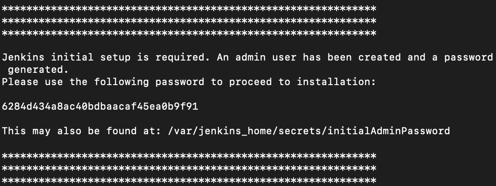
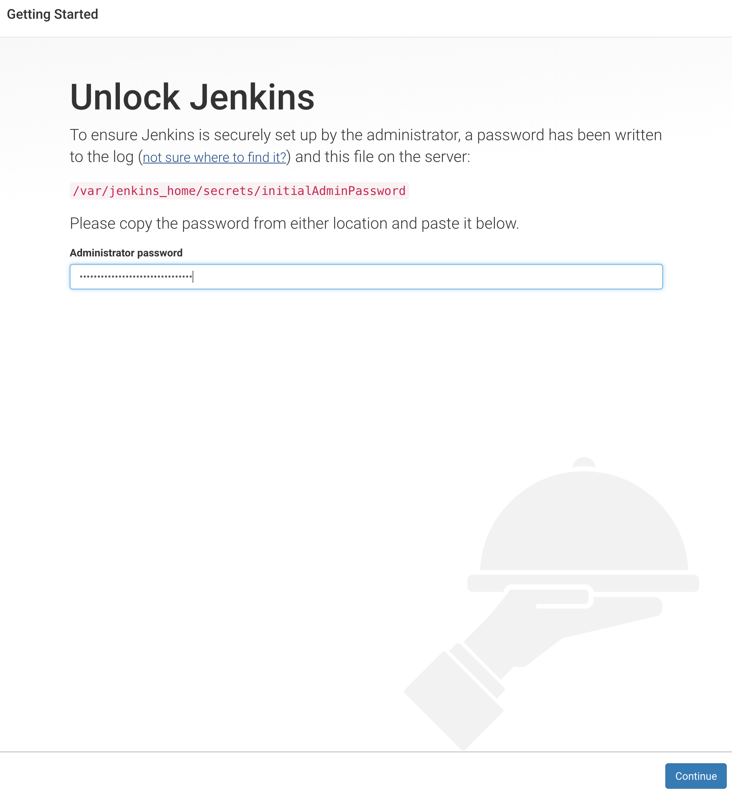
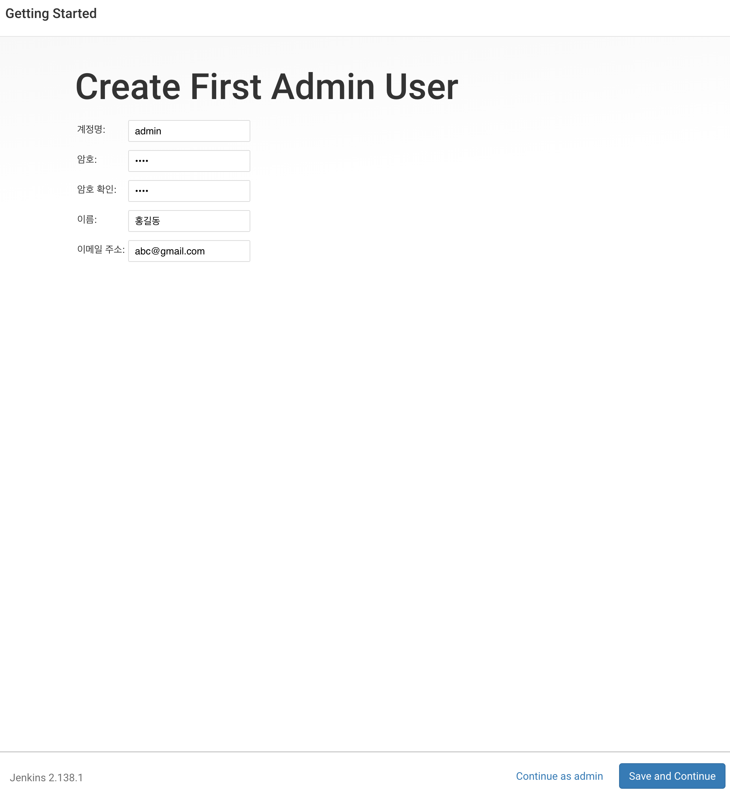
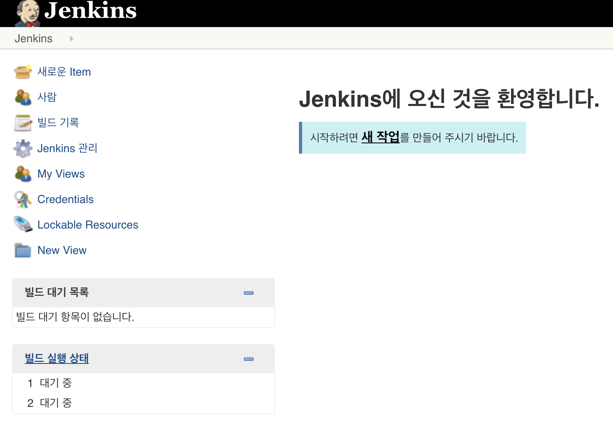
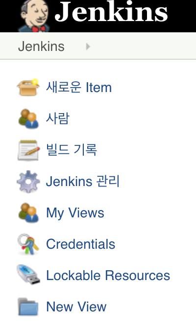
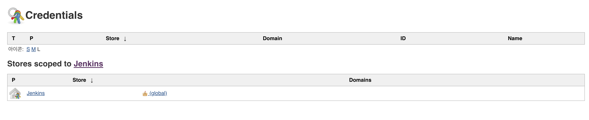
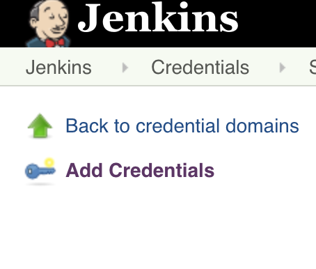
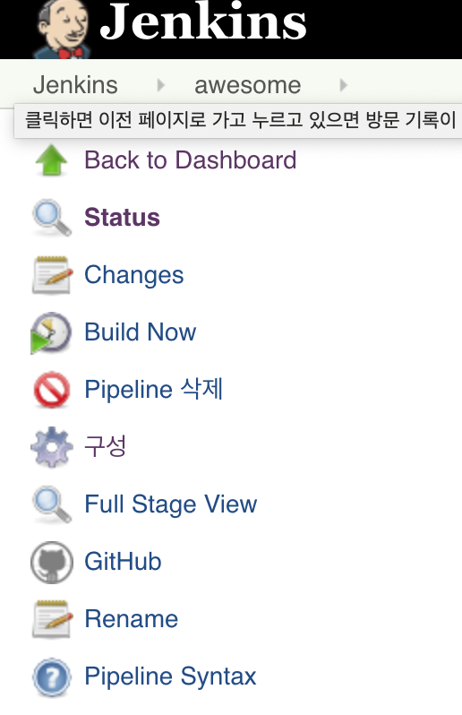
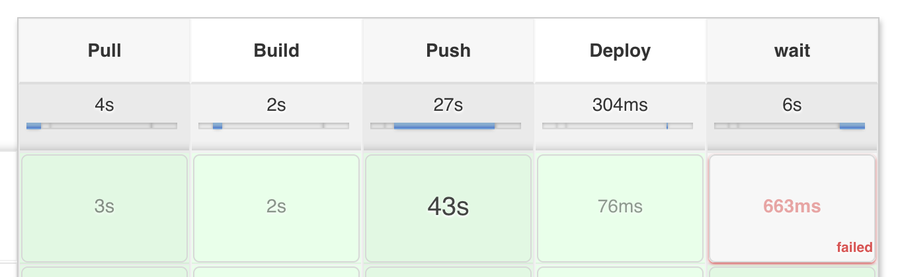

## 1. [Jenkins](https://jenkins.io/)

**Jenkins란 이미지를 자동으로 빌드하고 배포해주는 CI 툴입니다.**  
>
> TravisCI, CircleCI 등 여러 CI툴이 존재하지만 해당 실습에서는 대중적으로 많이 선택받고 있는 Jenkins를 사용합니다.  
> Jenkins는 Master/Agent로 구성되어 있으며, 굉장히 많은 플러그인을 제공합니다.
(Slack 알림 플러그인도 존재!)  

**CI/CD** 란?  
> CI(Continuous Integration) : 지속적 통합  
> CD(Continuous Delivery) : 지속적 배포  
> 보통 CI는 테스트하고 빌드하는 과정, CD는 빌드 이후에 배포까지의 과정을 의미합니다. 
> 
**해당 실습에서는 Jenkins를 이용해 다음과 같은 과정을 자동화합니다.**  
>
> 1. Pull (Github Repository)
> 2. Build (Docker Image)
> 3. Push (DockerHub)
> 4. Deploy
>
> Test, Container Update 등 더 많은 자동화가 가능하지만 해당 실습에서는 위 세 가지 과정만 자동화합니다.

## 2. Jenkins 실습
> 해당 실습에서는 DockerHub 계정이 필요합니다.
>
> 지금까지 컨테이너를 실행하고 이미지를 만들었던 과정을 Jenkins를 통해 자동화 해보겠습니다.

- #### 이미지 다운로드  
`$ docker pull subicura/jenkins:2`

- #### 젠킨스 이미지 실행

**MacOS**
```
docker run \
  -u root \
  --rm \
  -p 8080:8080 \
  --name jenkins \
  -v /Users/<USER_NAME>/jenkins_home:/var/jenkins_home \
  -v /var/run/docker.sock:/var/run/docker.sock \
  subicura/jenkins:2
```

**Windows**
```
docker run \
  -u root \
  --rm \
  -p 8080:8080 \
  --name jenkins \
  -v //c/jenkins:/var/jenkins_home \
  subicura/jenkins:2
```


> Jenkins Official Image(jenkins:lts)는 Docker 및 Docker-Compose가 설치되어 있지 않기 때문에  
별도의 이미지(subicura/jenkins:02)를 사용합니다.  
> DockerHub: https://hub.docker.com/r/subicura/jenkins/  
> Jenkins는 기본적으로 8080 포트를 이용하며, 그 외의 포트를 이용하기 위해서는 별도의 수정이 필요합니다.  

- #### 명령어를 실행하면 다음과 같이 키 값이 나옵니다.



- #### localhost:8080으로 접속 한 후 키 값을 입력하고 Continue를 클릭합니다.



- #### Install suggested plugins 를 선택합니다.


- #### 설치가 끝나면 계정을 생성해줍니다.



- #### Save and Finish를 클릭합니다.


- #### Start using Jenkins를 클릭해줍니다.


- #### 새 작업을 생성합니다.



- #### 이름을 지정하고, 해당 세미나에서는 Pipeline을 사용하기 때문에 Pipeline을 선택하고 OK를 클릭합니다.
> Pipeline을 선택하면 빋드하고 배포하는 과정을 Stage에 따라 설정하게 됩니다.


- #### 옵션 중 **Do not allow concurrent builds와 GitHub project**를 선택하고 저장을 누릅니다.
> Do not allow concurrent builds 옵션은 빌드가 진행중인 상태에서는 다음 빌드를 진행하지 않습니다.  
> Github project는 Github 주소 등록을 위해 선택합니다.  
> Github 주소: https://github.com/sangyeol-kim/node-app


- #### Jenkins 메인 화면으로 이동하고 화면 왼쪽의 Credentials를 클릭합니다.
> Pipeline Script에서 DockerHub 계정을 사용하기 위해 Credentials을 생성합니다.
> 해당 실습에서는 Credentials Binding Plugin을 사용합니다.



- #### Global을 선택합니다.



- #### 왼쪽에서 Add Credentials를 선택합니다.



- #### 도커허브 계정을 입력합니다.
> **ID는 반드시 기억해주세요! Pipeline Stage에서 사용됩니다.**


- #### 이제 Pipeline Stage를 작성해보겠습니다.  구성으로 들어가주세요.



- #### 그리고 아래에 Pipeline Script에 호스트 환경에 맞는 코드를 입력하고 저장을 누릅니다.


> **Credential_ID 에는 아까 생성한 Credential ID를 적어주세요!**

**MacOS**
```
node{
    withCredentials([usernamePassword(credentialsId: 'Credential_ID', usernameVariable: 'DOCKER_HUB_ID', passwordVariable: 'DOCKER_HUB_PASSWORD')]) {
        stage('Pull') {
            git 'https://github.com/sangyeol-kim/node-app'
        }
        stage('Build') {
            sh(script: 'docker build --force-rm=true -t ${DOCKER_HUB_ID}/node-jenkins:latest .')
            // 빌드가 실패한 경우에는 컨테이너 제거
        }
        stage('Push') {
            sh(script: 'docker login -u ${DOCKER_HUB_ID} -p ${DOCKER_HUB_PASSWORD}')
            sh(script: 'docker push ${DOCKER_HUB_ID}/node-jenkins:latest')
        }
        stage('Deploy') {
            try {
                stage ('Wait') {
                    sh(script: 'docker stop node-jenkins') 
                    sh(script: 'docker rm node-jenkins')
                }
            } catch (err) {
                echo 'node-jenkins container not exists'
            }
            sh(script: 'docker run -d -p 3000:3000 --name=node-jenkins ${DOCKER_HUB_ID}/node-jenkins:latest')
        }
    }
}
```

**Windows**
> 윈도우에서 젠킨스가 호스트의 도커와 통신을 하기 위해서는 withEnv로 Stage를 감싸줘야 합니다.

```
node{
    withEnv(['DOCKER_HOST=tcp://docker.for.win.localhost:2375']) { 
        withCredentials([usernamePassword(credentialsId: 'Credential_ID', usernameVariable: 'DOCKER_HUB_ID', passwordVariable: 'DOCKER_HUB_PASSWORD')]) {
            stage('Pull') {
                git 'https://github.com/sangyeol-kim/node-app'
            }
            stage('Build') {
                sh(script: 'docker build --force-rm=true -t ${DOCKER_HUB_ID}/node-jenkins:latest .')
                // 빌드가 실패한 경우에는 컨테이너 제거
            }
            stage('Push') {
                sh(script: 'docker login -u ${DOCKER_HUB_ID} -p ${DOCKER_HUB_PASSWORD}')
                sh(script: 'docker push ${DOCKER_HUB_ID}/node-jenkins:latest')
            }
            stage('Deploy') {
                try {
                    stage ('Wait') {
                        sh(script: 'docker stop node-jenkins') 
                        sh(script: 'docker rm node-jenkins')
                    }
                } catch (err) {
                    echo 'node-jenkins container not exists'
                }
                sh(script: 'docker run -d -p 3000:3000 --name=node-jenkins ${DOCKER_HUB_ID}/node-jenkins:latest')
            }
        }
    }
}

```

- #### Jenkins 프로젝트로 돌아와서 Build Now를 클릭합니다.


- #### 다음과 같이 빌드가 완료되면 [DockerHub](https://hub.docker.com/)로 이동합니다.


> 첫 컨테이너를 실행할때는 wait stage에서 failed가 발생하는 것이 정상입니다.

- #### 이미지가 생성되었습니다!


> 지금까지 Jenkins를 통해 Github Repository로 부터 소스를 다운로드 받고 이미지를 배포하는 과정을 자동화 했습니다.  
> 해당 실습은 latest 이미자만 배포하며, 추가 Stage 설정으로 tag 별 배포도 가능합니다.  


이제 [3. AWS ECS](./3.AWS_ECS/README.md)로 넘어가주세요!


---