## 1. [AWS ECS](https://aws.amazon.com/ko/ecs/)

**ECS (Elastic Container Service)**  
> AWS에서 제공하는 서비스로서 도커를 쉽게 관리 및 서비스 할 수 있도록 도커의 상태, 도커 컨테이너 등을 AWS Web Interface와 CLI를 이용해 관리 할 수 있습니다.
> 또한 ECS를 사용하면 도커의 에러메세지, 오토스케일링 등 다양한 DevOps 환경을 구성 할 수 있습니다.

**Cluster**
> 컨테이너 인스턴스들의 집합이며, 여러개의 EC2 Instance와 Docker Container로 구성 될 수 있습니다.

**Task**
> 클러스트 위에서 동작하는 Docker Container  
> Task Definition은 도커 컨테이너에 대한 설정으로 docker run에서 사용되는 작업을 설정 할 수 있습니다.

**Service**
> Task 내용들의 집합으로 컨테이너에 대한 자세한 설정을 할 수 있습니다.

## 12. [AWS ECS](https://aws.amazon.com/ko/ecs/) 실습
> 해당 실습에서는 AWS 프리티어 계정과 AWS CLI가  필요합니다.

- ### AWS CLI 설치하기
> 각 환경에 맞게 설치를 진행해주세요  
> https://docs.aws.amazon.com/ko_kr/cli/latest/userguide/installing.html

- ### AWS CLI Profile 등록  
`$ aws configure`  
> AWS Access Key ID:  
> AWS Secret Access Key:  
> Default region name: ap-northeast-2  
> Default output format: ENTER  

**AWS Credential이 없는 경우**
1. #### AWS 콘솔 로그인 후 보안, 자격 증명 및 규정 준수 - IAM으로 이동합니다.

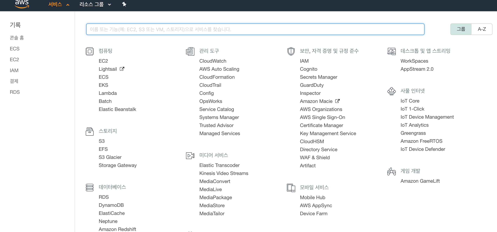

2. #### 사용자 클릭 후 사용자 추가를 선택해주세요.

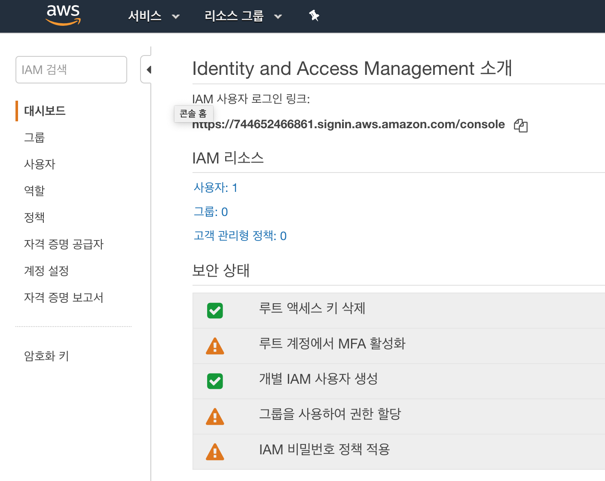

3. #### 사용자 이름과 프로그래밍 방식 액세스를 선택해주세요.

4. #### 기존 정책 직접 연결 선택 후 AdministratorAccess 선택해주세요.

5. #### 나머지 설정은 생략 후 사용자 만들기를 선택해주세요.

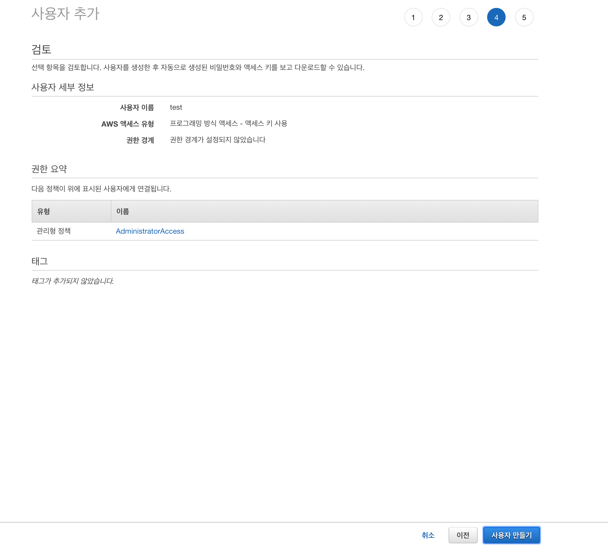

6. #### 액세스 키 ID와 비밀 액세스 키 확인
> 비밀 액세스 키는 꼭 기억해주세요

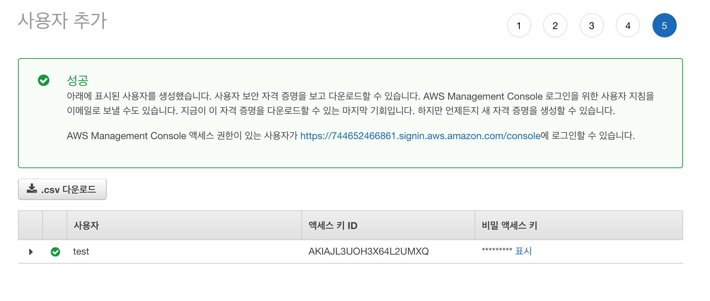

- ### [ECR](https://aws.amazon.com/ko/ecr/)에 이미지 업로드
> ECR은 이미지를 쉽게 저장, 관리 및 배포를 할 수 있는 Docker Container Registry 서비스입니다.  
> ECR은 ECS와 통합되어 Production Flow를 단순화 할 수 있습니다.

1. #### AWS 콘솔에서 컴퓨팅 - ECS로 이동합니다.

2. #### 새 레포지토리를 생성하고, 안내되는 커맨드를 실행합니다.
> 레포지토리 URL을 기억해주세요
> 레포지토리 이름은 일관성을 위해 호스트 환경와 동일한 컨테이너 이름을 사용하는 것을 추천합니다.

> 커맨드 입력 전 `$ docker login`을 입력해주세요.

> Push 이후 no basic auth credentials가 반환 될 경우  
 `eval $(aws ecr get-login --no-include-email | sed 's|http://<레포지토리_URI>/<Image_name>||')`를 입력해주세요.  

- ### 작업 정의(Task Definition) 생성
> Task function은 Docker CLI의 docker run 명령어와 같지만 여러 컨테이너에 작동합니다.

1. #### 새 작업 정의를 생성을 선택해주세요.

2. #### EC2를 선택해주세요.

3. #### 작업 정의 이름을 입력해주세요.

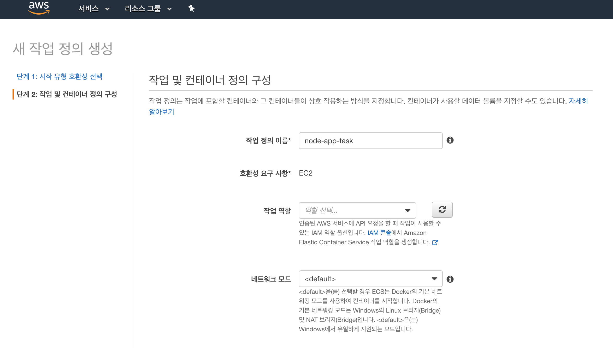

4. #### 컨테이너 추가를 선택해주세요.

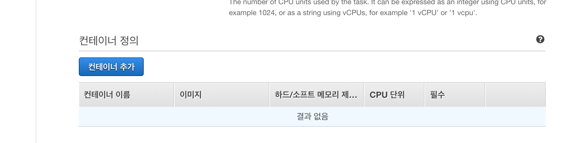

5. #### 컨테이너를 아래와 같이 구성해주세요.
> 컨테이너 이름은 Push한 애플리케이션명을 사용해주세요.
> 이미지 URL은 레포지토리 URL을 입력해주시면 됩니다.
> 메모리 제한에 하드 옵션을 사용하면 도커가 한계를 초과했을 때 켄테이너를 종료합니다.
> 소프트 옵션을 사용하면 한계를 넘어도 컨테이너가 종료되지 않습니다.

6. #### 컨테이너 추가 후 작업 정의를 생성합니다.

- ### 클러스트 생성
> 클러스트는 AWS 컨테이너가 실행되는 장소이며, EC2 Instance와 유사한 구성을 사용합니다.

1. #### 클러스트 생성을 클릭하고, EC2 Linux + 네트워킹을 선택합니다.

2. #### 클러스트를 다음과 같이 구성하고 클러스터를 생성합니다.
> 해당 실습에서는 EC2 Instance에 SSH를 포함하지 않습니다.

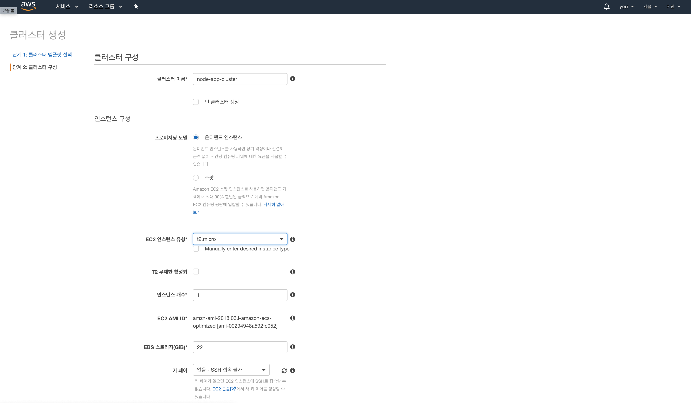
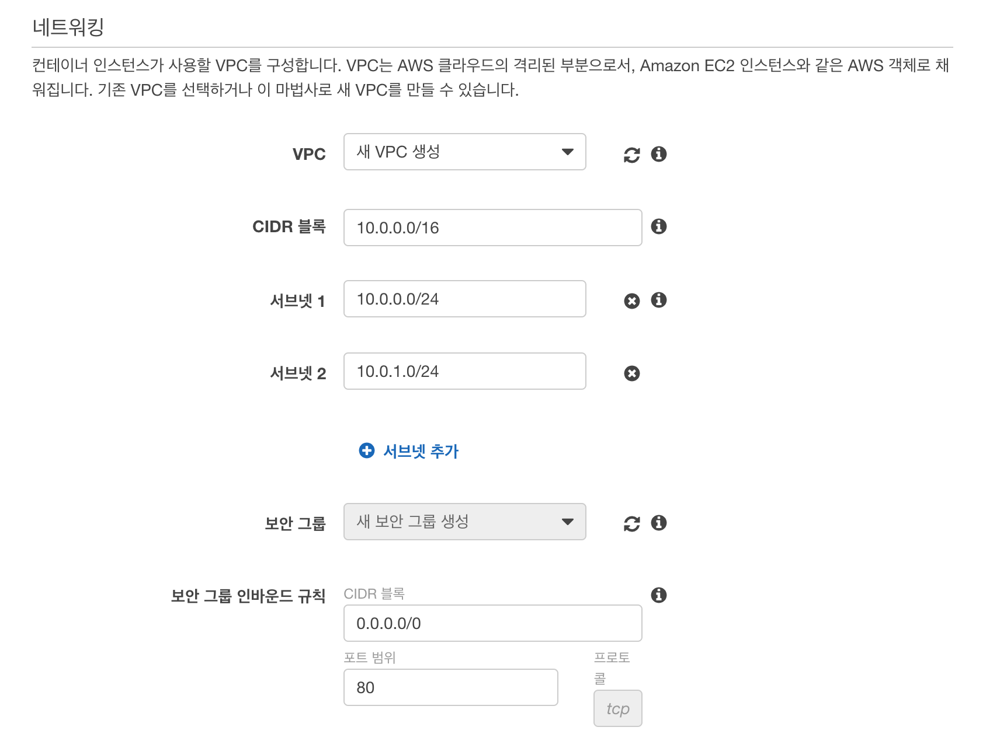

- ### 서비스 생성

1. #### 작업 정의로 이동하여 생성한 작업 정의 체크 후 드롭박스를 클릭하고 서비스 생성을 선택합니다.

2. #### 서비스를 다음과 같이 구성하고 생성합니다.
> 나머지는 기본 설정을 따르고 서비스를 생성해주세요.
> 해당 실습에서는 로드밸런서와 오토스케일링 옵션을 사용하지 않습니다.

- ### 서비스 확인

1. #### 클러스터로 이동하여 생성한 클러스터를 선택합니다.

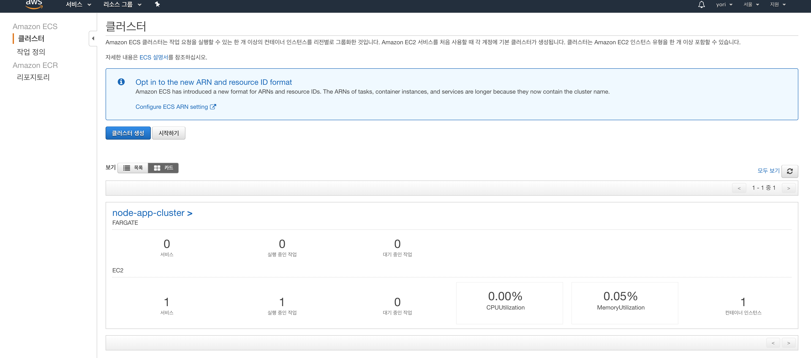

2. #### ECS 인스턴스 - 컨테이너 인스턴스를 클릭합니다.

3. #### Public DNS를 확인하고 접속합니다.

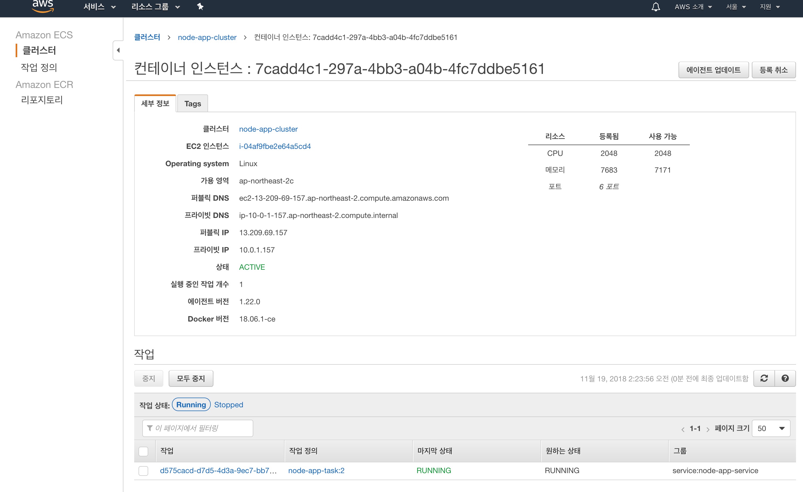

4. #### `Hello, world!`

---

## 3. 과금 방지를 위한 [AWS ECS/ECR](https://aws.amazon.com/ko/ecs/) 삭제
> 해당 실습에서는 과금 방지를 위해 지금까지 생성한 ECS를 삭제해보도록 하겠습니다.

- ### 서비스 삭제
> 클러스터를 삭제하기 전 먼저 클러스트 내의 서비스를 삭제해야 합니다.

1. #### 생성한 작업 정의를 클릭합니다.

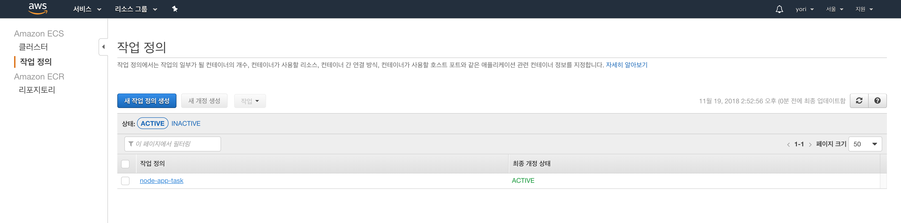

2. #### 생성한 작업 정의 이름을 선택하고 드롭박스를 클릭해 등록 취소를 클릭합니다.

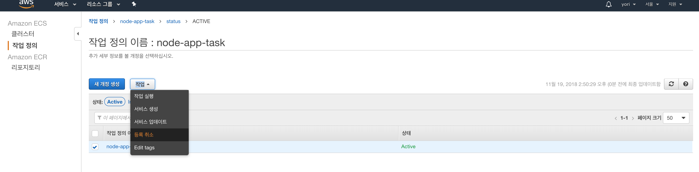

- ### 클러스트 삭제

1. #### 생성한 클러스트로 이동하여 클러스트 삭제를 클릭합니다.
> 약 1~2분 정도의 시간이 소요됩니다.

- ### ECR 레포지토리 삭제

1. #### ECR 레포지토리로 이동하여 생성한 레포지토리를 선택하고 삭제합니다.

고생하셨습니다!!

---

