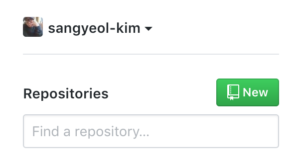
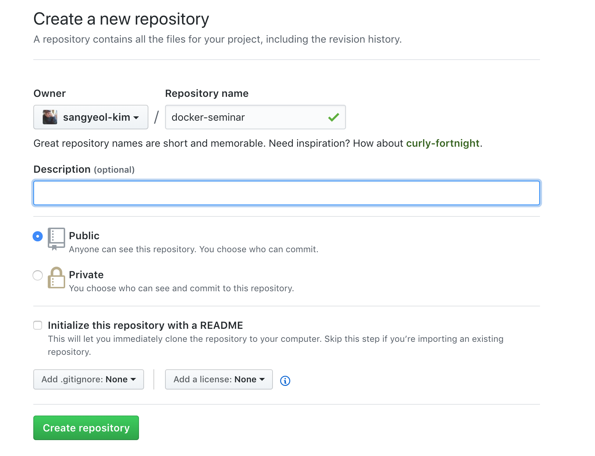

# Docker 입문자를 위한 세미나

## 사전 준비


- AWS 및 Dockerhub 계정 그리고 호스트 환경에 맞는 Docker 설치가 필요합니다.
- http://meetu.ps/e/G2jdh/CRhtw/f 밋업 공지를 확인해주세요.

## 1. GitHub Repository 만들기


1. 홈페이지 화면에서 "New repository"를 클릭합니다.



2. 이름과 내용을 작성하고 생성해주세요.




## 2. [Docker](https://www.docker.com/)

> Docker는 리눅스 애플리케이션을 컨테이너로 묶어서 실행할 수 있는 오픈소스 컨테이너 프로젝트로써,  
이를 통해 개발과 테스트, 그리고 서비스 환경을 하나로 통합하여 효율적으로 관리할 수 있도록 도와주는 툴 입니다.
>
> Docker를 사용하면 이미지를 통해 개발환경의 제약 없이 자유로운 배포가 가능합니다.
>
> 그 외 에도 AWS와 같은 클라우드 환경을 사용할때도 이미지 단위의 배포가 가능하며,  
트래픽 문제가 발생했을 경우 Docker 컨테이너를 원하는만큼 생성해 처리량을 쉽게 늘릴 수 있습니다.

## 3. Docker Demo 01


1. hello, world 출력하기


    `$ docker run -it ubuntu:latest echo 'hello, world!`


    해당 명령어를 실행하면 호스트 환경이 아닌 ubuntu 환경의 컨테이너에서 `hello, world`가 출력됩니다.  
    또한 지금 명령어를 실행한 터미널은 본인의 호스트 환경이지만 직접 ubuntu(CentOS...) Shell을 이용할 수도 있습니다.  


2. ubuntu Shell에서 hello, world 출력하기


    1. `$ docker run -it ubuntu:latest bash`
        bash는 기본 커맨드이므로 생략 가능합니다.  
    2. `$ echo hello, world`  
    이전의 `hello world`는 호스트 환경에서 실행한 ubuntu 명령어 였지만  
    지금은 직접 ubuntu shell로 들어와 `hello world`를 출력했습니다.
    3. `$ ls`  
    ubuntu 컨테이너 이기 때문에 맥이나 윈도우가 아닌 ubuntu 파일 시스템을 확인할 수 있습니다.  

## 4. Docker에 대한 이해 


1. Docker는 VM(Vitual Machine) 일까?
    > **No**  
    실제로 굉장히 비슷하지만 Docker와 VirtualMachine 과는 여러가지 다른 점이 존재합니다.  
    그 중 하나는 하드웨어 가상화 여부 입니다.
    VirtualBox나 VirtualMachine은 하드웨어 가상화가 이루어집니다.  
    하드웨어 가상화란 운영체제 위에 소프트웨어로 구성된 하드웨어가 하나 더 있는 것이라고 생각하셔도 좋습니다.


2. 컨테이너


    > 도커에서 사용하는 컨테이너는 하나의 프로세스 이며, 하드웨어 가상화가 아닌 격리된 환경에서 실행되는 프로세스 입니다.  
    >
    > Docker는 Linux Container 기술이기 때문에 MacOS 또는 Windows에서 사용 할 경우
    각각의 가상화 환경(xhyve / hyper-V)에서 돌아갑니다.  
    >
    > Windows Container도 존재하지만 해당 세미나에서는 Linux Container만 다룹니다.  


3. 이미지


    > 이미지는 특정 프로세스를 실행하기 위한 환경 (파일들의 집합)  
    도커는 계층화 된 파일 시스템을 사용하는데 이미지 위의 이미지를 엎는 방식을 사용하고 있습니다.

(결국 파일들을 모아놓은 것이 이미지/ 이것을 이용해 프로세스를 띄운다고 생각)
(여기서 실제로 Mac의 xhive 언급/ 우리가 봤던 것은 모두 프로세스 였다. 우분투도 프로세스)
(컨테이너는 프로세스일뿐이며 아까의 배쉬 또한 서버에 접속한 ㅓㅅ이 아닌배쉬라는 프ㅗ세스를 사용한 것.)


## 5. 도커 명령어


1. 컨테이너 확인  
`$ docker ps`
ps 명령어를 통해 실행중인 컨테이너를 확인 할 수 있습니다.
> **-a 옵션을 통해 정지된 컨테이너도 확인 가능**

2. 컨테이너 정지  
`$ docker stop <containier_id>`

3. 컨테이너 삭제  
`$ docker rm <container_id>`
rm 명령어를 통해 종료된 컨테이너를 삭제할 수 있습니다.

4. 컨테이너 로그  
`$ docker logs <container_id>`
logs 명령어를 통해 컨테이너의 동작 상태를 확인할 수 있습니다.
> **-f 옵션을 통해 실시간으로 생성된 로그를 확인 가능**

5. 이미지 목록  
`$ docker images`
호스트에 설치되어 있는 이미지를 확인할 수 있습니다.

6. 이미지 삭제  
`$ docker rmi <image_name>`

7. 이미지 다운로드  
`$ docker pull <image_name>:<tag>`
> **run 명령어를 실행하면 이미지가 없는 경우 자동으로 pull 합니다.**


## 6. 이미지 생성


> 지금까지 사용해 본 이미지는 DockerHub에 올라와 있는 이미지 입니다.  
>
> 지금 실습부터는 직접 이미지를 만들어 보겠습니다. (우분투 기본 이미지에 git을 추가)

(컨테이너를 이미지로 저장하기)
(컨테이너의 이미지 이해)
(도커의 파일 시스템은 단순한 큰 덩어리가 아닌 이미지 레이어로 구성되어 있음)
(도커 풀 또는 런 했을 때 이미지가 한 덩어리가 아닌 여러개를 받아오는 걸 볼 수 있음)

1. ubuntu Container 실행  
`$ docker run -it ubuntu:latest bash`

2. `$ apt-get update`
    > 최신버전이 아닐 시 제대로 설치되지 않는 버그가 발생할 수 있습니다.

3. git 설치  
`$ apt-get install git`  
> **기본 ubuntu 이미지로 실행한 컨테이너에 git이 설치 된 상태**
(컨테이너에서 작업한 내용은 저장이 되지 않는다 현재 컨테이너는 일회성)
(즉, 컨테이너에서 git을 생성하고 새로운 이미지로 생성해야 git이 설치된 이미지)
(간단한 실습 새로운 터미널에서 다시 배쉬를 실행하고 git version 확인)
(docer diff를 통해 git이 설치된 로그를 확인)

4. Commit Cammand를 이용한 이미지 생성  
`docker commit <container_id> <image>:<tag>`

5. 이미지 확인  
`docekr images | grep git`

6. 생성한 이미지를 이용해 켄테이너 실행  
`docker run -it ubuntu:git bash`

(Base image가 ubuntu:latest 이곳은 일회성 컨테이너)
(이 컨테이너에서 작업한 내용을 custom image로 만들기 위해서 docker commit을 이용)


## 6. Dockerfile


> Dockerfile이란 이미지 생성 과정을 기술한 일종의 Docker 전용 DSL(Domain Specific Language)  
> DSL이란 특정 도메인(Docker)에 특성화 된 Little Language  
> ex) Markdown Language

> Dockerfile을 통해 이전에 생성한 이미지를 똑같이 만들어보겠습니다.

1. Dockerfile 생성  
`$ touch Dockerfile`

2. Dockerfile 작성
> 에디터 또는 vim 등을 이용하여 생성한 Dockerfile 아래 코드를 작성해주세요
``` 
    FROM ubuntu:latest
    RUN apt-get update
    RUN apt-get install -y git 
```

3. `$ docker build -t <image_name>:<tag> .`
> 여기서 . 의 의미는 현재 디렉토리 아래에 있는 Dockerfile을 이용해 이미지를 만들겠다는 의미입니다.  
> -t 는 이미지의 이름을 지정해주는 명령어 입니다.
>
> 보통 commit이 아닌 Dockerfile을 이용해 이미지를 만들게 됩니다.
>
4. 이미지가 생성되었는지 확인해보겠습니다.
`$ docker images | grep <image_name>:<tag>`  


## 7. Dockerfile 추가 명령어
> 지금까지 작성한 Dockerfile은 FROM과 RUN 명령어로만 구성되어 있습니다.
>
> 추가적으로 중요한 명령어 몇 가지를 알아보겠습니다.

1. FROM
> FROM 명령어는 `FROM <image_name>:<tag>` 형식으로 지정할 수 있습니다.  
<image_name> 에는 base image가 지정됩니다. 
ex) ubuntu:16.04

2. ADD
> ADD 명령어는 `ADD <file_name> <file_path>`로 구성되며, 보통 Dockerfile은 애플리케이션과
같은 디렉토리에 넣게 되는데 그 이유는 디렉토리 안의 파일을 원하는 대로 추가할 수 있기 때문입니다.

3. RUN
> RUN 명령어는 `RUN <Command>`로 작성할 수 있으며, 컨테이너를 실행한 후 실행하는 명령어를 작성합니다.  
> RUN 명령어는 보통 bash에서 사용하지 않고, Dockerfile을 이용하여 실행합니다.  
**`$ apt-get install git` 과 같이 중간에 응답해야 하는 부분이 있다면 꼭 -y 옵션을 추가해야 합니다.**

4. WORKDIR
> WORKDIR은 디렉토리 환경 / ENV 환경변수 기본 값 지정 등의 여러 명령어가 있지만 해당 세미나에서는 깊게 다루지 않습니다.

5. CMD
> CMD 명령어는 도커를 실행했을 때 기본적으로 실행될 명령어를 지정합니다.
> 예를 들어 이전에 실행했던 `$docker run -it ubuntu:latest bash` 에서는 bash는 기본 명령어로 지정되어 있기 때문에 생략해도 실행이 됩니다.

## 8. Dockerfile로 웹 애플리케이션 이미지 만들기
> 해당 실습에서는 Github가 이용됩니다.
> 해당 실습은 Node.js 공식문서를 이용합니다.
> https://nodejs.org/ko/docs/guides/nodejs-docker-webapp/

**이제 본격적으로 Dockerfile을 이용해서 Custom Image를 만들어 보겠습니다.**

1. https://github.com/sangyeol-kim/docker_node_test 에 접속해 해당 프로젝트를 clone 해옵니다.
> 해당 프로젝트는 Node.js로 작성된 hello, world!를 출력하는 간단한 웹 애플리케이션입니다.

2. 해당 폴더로 접근해 `$ docker buld -t <username>/<app_name>:<tag>` 를 입력합니다.
> -t는 이미지에 이름을 부여하는 옵션이며, tag는 latest 또는 01과 같이 자유롭게 입력하시면 됩니다.  

3. `$ docker run -p 5555:4567 -d <username>/<app_name>:<tag>`
> -d 옵션을 주면 백그라운드에서 컨테이너가 실행됩니다.  
> -p 옵션을 통해 컨테이너 내부의 4567 port와 호스트의 5555 포트를 연결합니다.

4. `$ docker logs <container_id>` 를 통해 컨테이너가 정상적으로 실행됐는지 확인하고,
직접 localhost:5555에 접속해 확인해봅니다.
> Hello, world!가 정상적으로 출력된다면 실습을 성공적으로 마치셨습니다 :)

5. 컨테이너 내부에 접근하는 방법
> `$ docker exec -it <container id> /bin/bash`


## 9. Jenkins

> Jenkins란 이미지를 자동으로 빌드하고 배포해주는 CI 툴입니다.  
>
> TravisCI, CircleCI 등 여러 CI툴이 존재하지만 해당 실습에서는 대중적으로 많이 선택받고 있는 Jenkins를 사용합니다.  
> Jenkins는 Master/Agent로 구성되어 있으며, 굉장히 많은 플러그인을 제공합니다.
(Slack 알림 플러그인도 존재!)  
> 해당 실습에서는 Master만을 이용하여 진행합니다.  

> **CI/CD** 란?  
> CI(Continuous Integration) : 지속적 통합  
> CD(Continuous Delivery) : 지속적 배포  
> 보통 CI는 테스트하고 빌드하는 과정, CD는 빌드 이후에 배포까지의 과정을 의미합니다. 
> 
> Jenkins를 사용하면 다음 과정을 자동화 할 수 있습니다.  
>
> 1. 소스 저장소에 최신 소스를 Push (여기까진 개발자의 몫)
> 2. 전체 소스를 다운로드
> 3. 테스트
> 4. 도커 이미지 생성
> 5. 도커 이미지 저장 (DockerHub에 Push)
> 6. 애플리케이션 업데이트 (각 서버마다 떠있는 컨테이너에 새로운 이미지를 업데이트)


## 10. Jenkins Demo 01
> 해당 실습에서는 DockerHub 계정이 필요합니다.
>
> 지금까지 컨테이너를 실행하고 이미지를 만들었던 과정을 Jenkins를 통해 자동화 해보겠습니다.

**MacOS**
```
docker run -u root --rm -p 8080:8080 --name jenkins \ -v $(디렉토리):/var/jenkins_home \
-v /var/run/docker.sock:/var/run/docker.sock \ twysgs/jenkins:latest
```
**Windows**
```
docker run -u root --rm -p 8080:8080 --name jenkins \ -v $(디렉토리):/var/jenkins_home \ twysgs/jenkins:latest
```

> $(디렉토리)에는 
**MacOS: /Users/${USER}/Download/jenkins**
**Windows: //c/jenkins 와 같이 입력해주세요.**  

> 기본 Jenkins 이미지에는 Docker와 Docker-Compose가 설치되어 있지 않기 때문에 기본 이미지가 아닌 별도의 이미지를 사용합니다.  
> Jenkins는 기본적으로 8080 포트를 이용하며, 그 외의 포트를 이용하기 위해서는 별도의 수정이 필요합니다.  
  