# Docker 입문자를 위한 세미나

## 사전 준비


- [AWS](https://aws.amazon.com) 및 [DockerHub](https://hub.docker.com/) 계정 그리고 호스트 환경에 맞는 Docker 설치가 필요합니다.
- 자세한 내용은 http://meetu.ps/e/G2jdh/CRhtw/f 밋업 공지를 확인해주세요.

## 1. [Docker](https://www.docker.com/)

> Docker는 리눅스 애플리케이션을 컨테이너로 묶어서 실행할 수 있는 오픈소스 컨테이너 프로젝트로써,  
이를 통해 개발과 테스트, 그리고 서비스 환경을 하나로 통합하여 효율적으로 관리할 수 있도록 도와주는 툴 입니다.
>
> Docker를 사용하면 이미지를 통해 개발환경의 제약 없이 자유로운 배포가 가능합니다.
>
> 그 외 에도 AWS와 같은 클라우드 환경을 사용할때도 이미지 단위의 배포가 가능하며,  
트래픽 문제가 발생했을 경우 Docker 컨테이너를 원하는만큼 생성해 처리량을 쉽게 늘릴 수 있습니다.

## 2. Docker 실습


1. hello, world 출력하기


    `$ docker run -it ubuntu:latest echo 'hello, world!'`


    해당 명령어를 실행하면 호스트 환경이 아닌 ubuntu 환경의 컨테이너에서 `hello, world`가 출력됩니다.  
    또한 지금 명령어를 실행한 터미널은 본인의 호스트 환경이지만 직접 ubuntu(CentOS...) Shell을 이용할 수도 있습니다.  


2. ubuntu Shell에서 hello, world 출력하기


    1. `$ docker run -it ubuntu:latest bash`  
        bash는 기본 커맨드이므로 생략 가능합니다.  
    2. `$ echo 'hello, world'`  
    이전의 `hello world`는 호스트 환경에서 실행한 ubuntu 명령어 였지만  
    지금은 직접 ubuntu shell로 들어와 `hello world`를 출력했습니다.
    3. `$ ls`  
    ubuntu 컨테이너 이기 때문에 맥이나 윈도우가 아닌 ubuntu 파일 시스템을 확인할 수 있습니다.
    4. `$ exit`  
    ubuntu 컨테이너를 종료하고, 호스트 환경으로 돌아갑니다.
## 3. Docker에 대한 이해 


1. Docker는 VM(Vitual Machine) 일까?
    > **No**  
    실제로 굉장히 비슷하지만 Docker와 VirtualMachine 과는 여러가지 다른 점이 존재합니다.  
    그 중 하나는 하드웨어 가상화 여부 입니다.
    VirtualBox나 VirtualMachine은 하드웨어 가상화가 이루어집니다.  
    하드웨어 가상화란 운영체제 위에 소프트웨어로 구성된 하드웨어가 하나 더 있는 것이라고 생각하셔도 좋습니다.


2. 컨테이너


> 도커에서 사용하는 컨테이너는 하나의 프로세스 이며, 하드웨어 가상화가 아닌 격리된 환경에서 실행되는 프로세스 입니다.  
> Docker는 Linux Container 기술이기 때문에 MacOS 또는 Windows에서 사용 할 경우
각각의 가상화 환경(xhyve / hyper-V)에서 돌아갑니다.  
> 그렇기 때문에 가상화 환경을 지원하지 않는 CPU로 작업한다면 제대로 동작하지 않습니다.

3. 이미지


> 이미지는 특정 프로세스를 실행하기 위한 환경입니다. (파일들의 집합)  
도커는 레이어 저장 방식을 통해 이미지 위의 이미지를 엎는 방식을 사용하고 있습니다.


## 4. 도커 명령어


1. 컨테이너 확인  
`$ docker ps`
ps 명령어를 통해 실행중인 컨테이너를 확인 할 수 있습니다.
> **docker -a <container_id>를 통해 정지된 컨테이너도 확인이 가능합니다.**

2. 컨테이너 정지  
`$ docker stop <container_id>`

3. 컨테이너 삭제  
`$ docker rm <container_id>`
rm 명령어를 통해 종료된 컨테이너를 삭제할 수 있습니다.

4. 컨테이너 로그  
`$ docker logs <-f> <container_id>`
logs 명령어를 통해 컨테이너의 동작 상태를 확인할 수 있습니다.
> **-f 옵션을 통해 실시간으로 생성된 로그를 확인 가능**

5. 이미지 목록  
`$ docker images`
호스트에 설치되어 있는 이미지를 확인할 수 있습니다.

6. 이미지 삭제  
`$ docker rmi <image_name>`

7. 이미지 다운로드  
`$ docker pull <image_name>:<tag>`
> **run 명령어를 실행하면 이미지가 없는 경우 자동으로 pull 합니다.**


## 5. 이미지 생성


> 지금까지 사용해 본 이미지는 DockerHub에 올라와 있는 이미지 입니다.  
>
> 지금 실습부터는 직접 이미지를 만들어 보겠습니다.  (우분투 기본 이미지에 Node.js와 npm 설치)

1. ubuntu Container 실행  
`$ docker run -it ubuntu:latest bash`
> -it 옵션은 bash를 실행한 후 명령어를 입력 할 수 있게 해줍니다.
> docker는 기본적으로 'root'권한으로 실행됩니다.

2. Package Manager 업데이트  
`$ apt-get update`
> 최신 버전이 아닐 시 제대로 설치가 되지 않을 수 있습니다.

3. Node.js 및 npm 설치  
`$ apt-get install nodejs`  
`$ apt-get install npm`  
> **기본 ubuntu 이미지로 실행한 컨테이너에 Node.js와 npm이 설치된 상태**

4. 호스트 환경으로 돌아가기
`$ exit`

5. Commit Command를 이용한 이미지 생성  
`docker commit <container_id> <image_name>:<tag>`
> 종료된 컨테이너의 container_id는 'docker ps -a'를 통해 확인할 수 있습니다.
> 'image_name'과 'tag'는 임의로 설정할 수 있습니다.

6. 이미지 확인  
`docker images | grep <image_name>`

7. 생성한 이미지를 이용해 컨테이너 실행  
`docker run -it <image_name>:<tag> bash`


## 6. Dockerfile


> Dockerfile이란 이미지 생성 과정을 기술한 일종의 Docker 전용 DSL(Domain Specific Language)  
> DSL이란 특정 도메인(여기선 Docker)에 특성화 된 Little Language  
> ex) Markdown Language

> Dockerfile을 통해 이전에 생성한 이미지를 똑같이 만들어보겠습니다.

1. Dockerfile 생성


`$ touch Dockerfile`

2. Dockerfile 작성
> 에디터 또는 vim 등을 이용하여 생성한 Dockerfile에 아래 코드를 작성해주세요.
``` 
    FROM ubuntu:latest
    RUN apt-get update
    RUN apt-get install -y nodejs
    RUN apt-get install -y npm 
```
> **Dockerfile에서 apt-get을 사용할 때 반드시 -y 옵션을 사용해주세요**

3. `$ docker build -t <image_name>:<tag> .`
> 여기서 . 의 의미는 현재 디렉토리 아래에 있는 Dockerfile을 이용해 이미지를 만들겠다는 의미입니다.  
> -t 는 이미지의 이름을 지정해주는 명령어 입니다.
>
> 보통 commit이 아닌 Dockerfile을 이용해 이미지를 만들게 됩니다.
>
4. 명령어를 통해 이미지가 생성되었는지 확인해보겠습니다.  
`$ docker images | grep <image_name>:<tag>`  


## 7. Dockerfile 추가 명령어
> 지금까지 작성한 Dockerfile은 FROM과 RUN 명령어로만 구성되어 있습니다.
>
> 추가적으로 중요한 명령어 몇 가지를 알아보겠습니다.

1. FROM
> FROM 명령어는 `FROM <image_name>:<tag>` 형식으로 지정할 수 있습니다.  
<image_name> 에는 base image가 지정됩니다. 
ex) ubuntu:16.04

2. ADD
> ADD 명령어는 `ADD <file_name> <file_path>`로 구성되며, 보통 Dockerfile은 애플리케이션과
같은 디렉토리에 넣게 되는데 그 이유는 디렉토리 안의 파일을 원하는 대로 추가할 수 있기 때문입니다.

3. RUN
> RUN 명령어는 `RUN <Command>`로 작성할 수 있으며, 컨테이너를 실행한 후 실행하는 명령어를 작성합니다.  
> RUN 명령어는 보통 bash에서 사용하지 않고, Dockerfile을 이용하여 실행합니다.  
**`$ apt-get install nodejs` 와 같이 중간에 응답해야 하는 부분이 있다면 꼭 -y 옵션을 추가해야 합니다.**

4. WORKDIR
> WORKDIR은 디렉토리 환경 / ENV 환경변수 기본 값 지정 등의 여러 명령어가 있지만 해당 세미나에서는 자세히 다루지 않습니다.

5. CMD
> CMD 명령어는 도커를 실행했을 때 기본적으로 실행될 명령어를 지정합니다.
> 예를 들어 이전에 실행했던 `$docker run -it ubuntu:latest bash` 에서 bash는 기본 명령어로 지정되어 있기 때문에 생략해도 실행이 됩니다.

## 8. Dockerfile로 간단한 애플리케이션 실행하기
> 해당 실습에서는 Github가 이용됩니다.  
> 해당 실습은 Node.js 공식문서를 이용합니다.
> https://nodejs.org/ko/docs/guides/nodejs-docker-webapp/

**이제 본격적으로 Dockerfile을 이용해서 node-app이라는 이름을 가진 Custom Image를 만들어 보겠습니다.**

1. https://github.com/sangyeol-kim/docker_node_test 에 접속해 해당 프로젝트를 clone 해옵니다.
> 해당 프로젝트는 Node.js로 작성된 hello, world!를 출력하는 간단한 웹 애플리케이션입니다.

2. 해당 폴더로 접근해 `$ docker build -t <dockerhub_id>/node-app:latest .` 을 입력합니다.
> 다음 실습에서 해당 이미지를 DockerHub에 업로드 할 예정입니다.  
> DockerHub에 이미지를 올리기 위해서는 이미지 이름을 <dockerhub_id>/<image_name>로 생성해야 합니다.

3. `$ docker run -p 3000:3000 <-d> <dockerhub_id>/node-app:latest`
> -d 옵션을 주면 백그라운드에서 컨테이너가 실행됩니다.  
> -p 옵션을 통해 컨테이너 내부와 호스트의 포트를 연결합니다.

4. `$ docker logs <container_id>` 를 통해 컨테이너가 정상적으로 실행됐는지 확인하고,
직접 localhost:3000에 접속해 확인해봅니다.
> Hello, world!가 정상적으로 출력된다면 실습을 성공적으로 마치셨습니다 :)

5. 컨테이너 내부에 접근하는 방법
`$ docker exec -it <container_id> bash`

## 9. DockerHub에 이미지 올리기
> 해당 실습에서는 DockerHub 계정이 필요합니다.

1. DockerHub에 로그인 합니다.  
`$ docker login`

2. DockerHub에 방금 생성한 이미지를 Push 합니다.  
`$ docker push <dockerhub_id>/node-app:latest`

3. [DockerHub](https://hub.docker.com/)로 이동합니다.  
> 아래와 같이 Repository가 생성되었으면 성공입니다!  
> DockerHub는 Repository를 별도로 생성하지 않더라도 이미지명에 따라 자동으로 생성합니다.  
> 같은 이름의 이미지라면 tag에 따라서 버전별로 저장됩니다.  

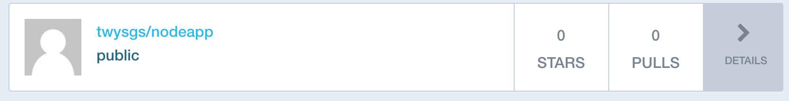


---


## 10. [Jenkins](https://jenkins.io/)

**Jenkins란 이미지를 자동으로 빌드하고 배포해주는 CI 툴입니다.**  
>
> TravisCI, CircleCI 등 여러 CI툴이 존재하지만 해당 실습에서는 대중적으로 많이 선택받고 있는 Jenkins를 사용합니다.  
> Jenkins는 Master/Agent로 구성되어 있으며, 굉장히 많은 플러그인을 제공합니다.
(Slack 알림 플러그인도 존재!)  

**CI/CD** 란?  
> CI(Continuous Integration) : 지속적 통합  
> CD(Continuous Delivery) : 지속적 배포  
> 보통 CI는 테스트하고 빌드하는 과정, CD는 빌드 이후에 배포까지의 과정을 의미합니다. 
> 
**해당 실습에서는 Jenkins를 이용해 다음과 같은 과정을 자동화합니다.**  
>
> 1. Pull (Github Repository)
> 2. Build (Docker Image)
> 3. Push (DockerHub)
> 4. Deploy
>
> Test, Container Update 등 더 많은 자동화가 가능하지만 해당 실습에서는 위 세 가지 과정만 자동화합니다.

## 11. Jenkins 실습
> 해당 실습에서는 DockerHub 계정이 필요합니다.
>
> 지금까지 컨테이너를 실행하고 이미지를 만들었던 과정을 Jenkins를 통해 자동화 해보겠습니다.

**MacOS**
```
docker run \
  -u root \
  --rm \
  -p 8080:8080 \
  --name jenkins \
  -v $(데이터 저장될 디렉토리):/var/jenkins_home \
  -v /var/run/docker.sock:/var/run/docker.sock \
  subicura/jenkins:02
```

**Windows**
```
docker run \
  -u root \
  --rm \
  -p 8080:8080 \
  --name jenkins \
  -v $(데이터 저장될 디렉토리):/var/jenkins_home \
  subicura/jenkins:02
```

> $(디렉토리)에는 
**MacOS: /Users/$(User_name)/Download/jenkins**
**Windows: //c/jenkins 와 같이 입력해주세요.**  

> Jenkins Official Image(jenkins:lts)는 Docker 및 Docker-Compose가 설치되어 있지 않기 때문에  
별도의 이미지(subicura/jenkins:02)를 사용합니다.  
> DockerHub: https://hub.docker.com/r/subicura/jenkins/  
> Jenkins는 기본적으로 8080 포트를 이용하며, 그 외의 포트를 이용하기 위해서는 별도의 수정이 필요합니다.  

- #### 명령어를 실행하면 다음과 같이 키 값이 나옵니다.


- #### localhost:8080으로 접속 한 후 키 값을 입력하고 Continue를 클릭합니다.


- #### Install suggested plugins 를 선택합니다.

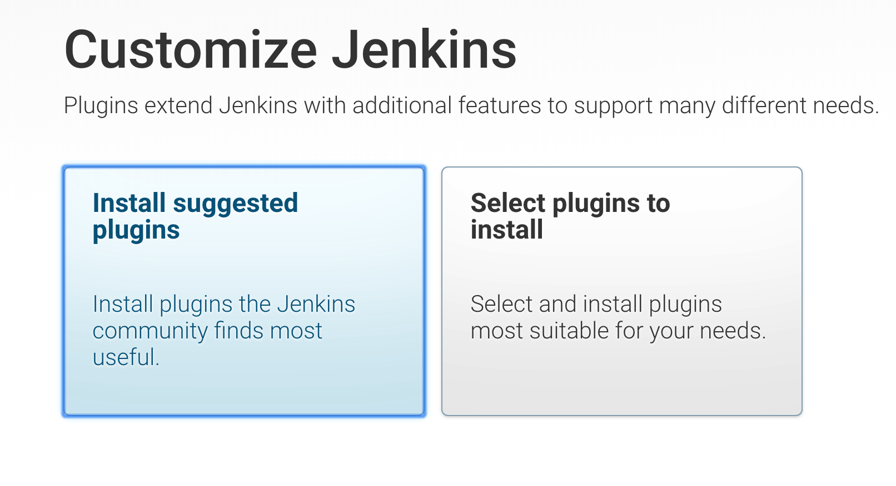

- #### 설치가 끝나면 계정을 생성해줍니다.


- #### Save and Finish를 클릭합니다.

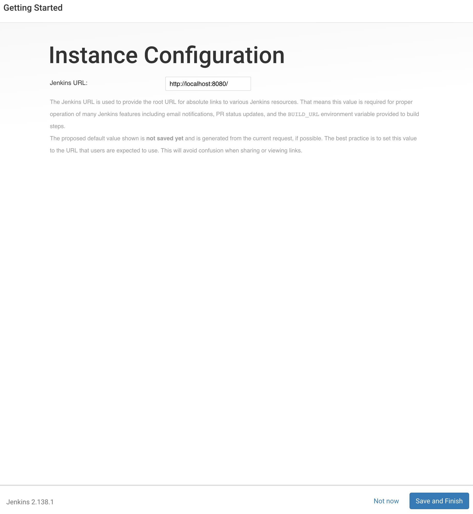

- #### Start using Jenkins를 클릭해줍니다.

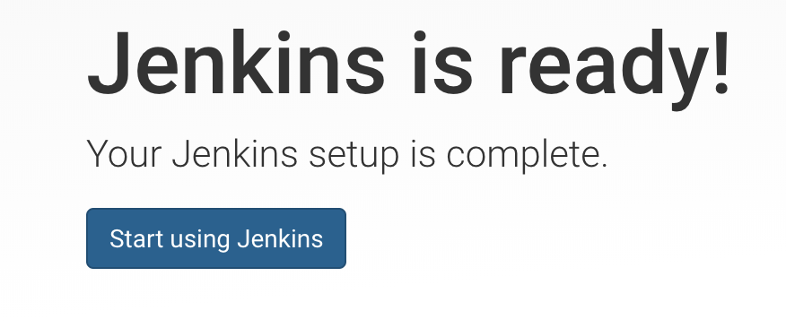

- #### 새 작업을 생성합니다.


- #### 이름을 지정하고, 해당 세미나에서는 Pipeline을 사용하기 때문에 Pipeline을 선택하고 OK를 클릭합니다.
> Pipeline을 선택하면 빋드하고 배포하는 과정을 Stage에 따라 설정하게 됩니다.

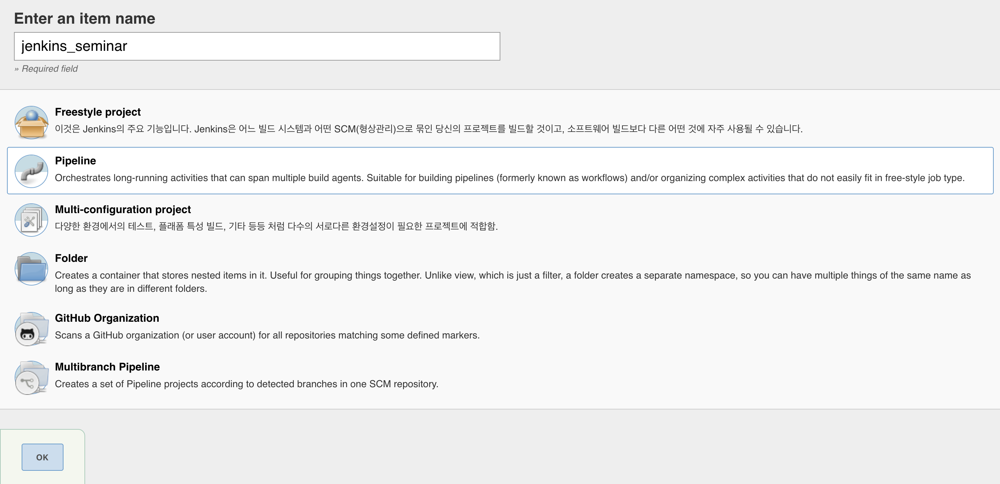

- #### 옵션 중 **Do not allow concurrent builds와 GitHub project**를 선택하고 저장을 누릅니다.
> Do not allow concurrent builds 옵션은 빌드가 진행중인 상태에서는 다음 빌드를 진행하지 않습니다.  
> Github project는 Github 주소 등록을 위해 선택합니다.  
> Github 주소: https://github.com/sangyeol-kim/docker_node_test

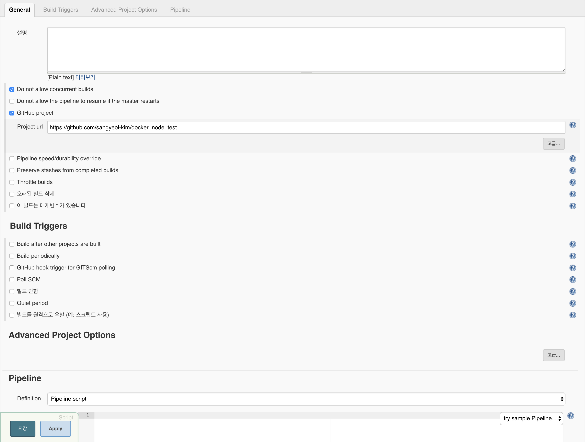

- #### Jenkins 메인 화면으로 이동하고 화면 왼쪽의 Credentials를 클릭합니다.
> Pipeline Script에서 DockerHub 계정을 사용하기 위해 Credentials을 생성합니다.
> 해당 실습에서는 Credentials Binding Plugin을 사용합니다.


- #### Global을 선택합니다.


- #### 왼쪽에서 Add Credentials를 선택합니다.


- #### 도커허브 계정을 입력합니다.
> **ID는 반드시 기억해주세요! Pipeline Stage에서 사용됩니다.**


- #### 이제 Pipeline Stage를 작성해보겠습니다.  구성으로 들어가주세요.


- #### 그리고 아래에 Pipeline Script에 다음 코드를 입력하고 저장을 누릅니다.

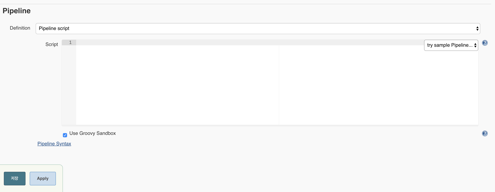

> **Credential_ID 에는 아까 생성한 Credential ID를 적어주세요!**
```
node{
    withCredentials([usernamePassword(credentialsId: 'Credential_ID', usernameVariable: 'DOCKER_HUB_ID', passwordVariable: 'DOCKER_HUB_PASSWORD')]) {
        stage('Pull') {
            git 'https://github.com/sangyeol-kim/docker_node_test'
        }
        stage('Build') {
            sh(script: 'docker build --force-rm=true -t ${DOCKER_HUB_ID}/node-jenkins:latest .')
            // 빌드가 실패한 경우에는 컨테이너 제거
        }
        stage('Push') {
            sh(script: 'docker login -u ${DOCKER_HUB_ID} -p ${DOCKER_HUB_PASSWORD}')
            sh(script: 'docker push ${DOCKER_HUB_ID}/node-jenkins:latest')
        }
        stage('Deploy') {
            try {
                stage ('Wait') {
                    sh(script: 'docker stop node-jenkins') 
                    sh(script: 'docker rm node-jenkins')
                }
            } catch (err) {
                echo 'node-jenkins container not exists'
            }
            sh(script: 'docker run -d -p 3000:3000 --name=node-jenkins ${DOCKER_HUB_ID}/node-jenkins:latest')
        }
    }
}
```

- #### Jenkins 프로젝트로 돌아와서 Build Now를 클릭합니다.

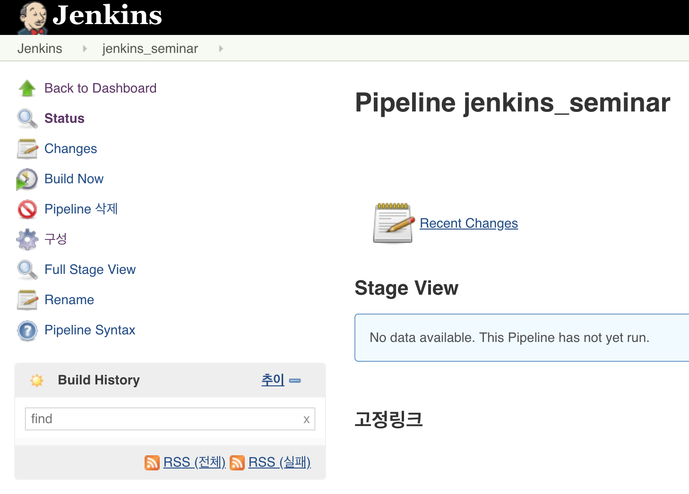

- #### 다음과 같이 빌드가 완료되면 [DockerHub](https://hub.docker.com/)로 이동합니다.


> 첫 컨테이너를 실행할때는 wait stage에서 failed가 발생하는 것이 정상입니다.

- #### 이미지가 생성되었습니다!


> 지금까지 Jenkins를 통해 Github Repository로 부터 소스를 다운로드 받고 이미지를 배포하는 과정을 자동화 했습니다.  
> 해당 실습은 latest 이미자만 배포하며, 추가 Stage 설정으로 tag 별 배포도 가능합니다.  


---


## 12. [AWS ECS](https://aws.amazon.com/ko/ecs/)

**ECS (Elastic Container Service)**  
> AWS에서 제공하는 서비스로서 도커를 쉽게 관리 및 서비스 할 수 있도록 도커의 상태, 도커 컨테이너 등을 AWS Web Interface와 CLI를 이용해 관리 할 수 있습니다.
> 또한 ECS를 사용하면 도커의 에러메세지, 오토스케일링 등 다양한 DevOps 환경을 구성 할 수 있습니다.

**Cluster**
> 컨테이너 인스턴스들의 집합이며, 여러개의 EC2 Instance와 Docker Container로 구성 될 수 있습니다.

**Task**
> 클러스트 위에서 동작하는 Docker Container  
> Task Definition은 도커 컨테이너에 대한 설정으로 docker run에서 사용되는 작업을 설정 할 수 있습니다.

**Service**
> Task 내용들의 집합으로 컨테이너에 대한 자세한 설정을 할 수 있습니다.

## 13. [AWS ECS](https://aws.amazon.com/ko/ecs/) 실습
> 해당 실습에서는 AWS 프리티어 계정과 AWS CLI가  필요합니다.

- #### AWS CLI 설치하기
> 각 환경에 맞게 설치를 진행해주세요  
> https://docs.aws.amazon.com/ko_kr/cli/latest/userguide/installing.html

- #### AWS CLI Profile 등록  
`$ aws configure`  
> AWS Access Key ID:  
> AWS Secret Access Key:  
> Default region name: ap-northeast-2  
> Default output format: ENTER  

**AWS Credential이 없는 경우**
1. #### AWS 콘솔 로그인 후 보안, 자격 증명 및 규정 준수 - IAM으로 이동합니다.


2. #### 사용자 클릭 후 사용자 추가를 선택해주세요.


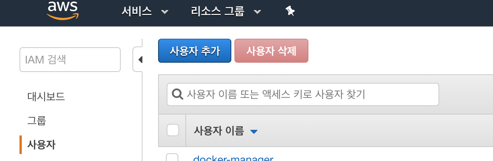


3. #### 사용자 이름과 프로그래밍 방식 액세스 입력해주세요.

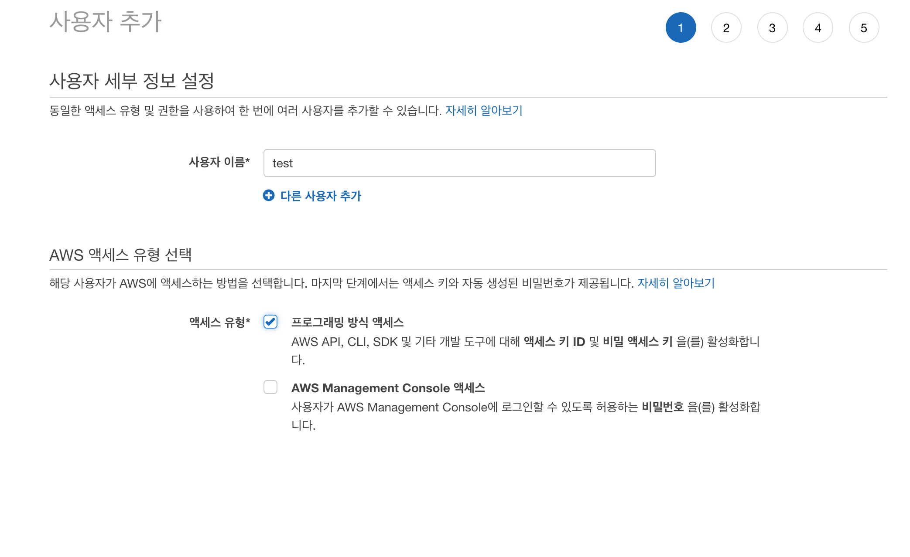


4. #### 기존 정책 직접 연결 선택 후 AdministratorAccess 선택해주세요.

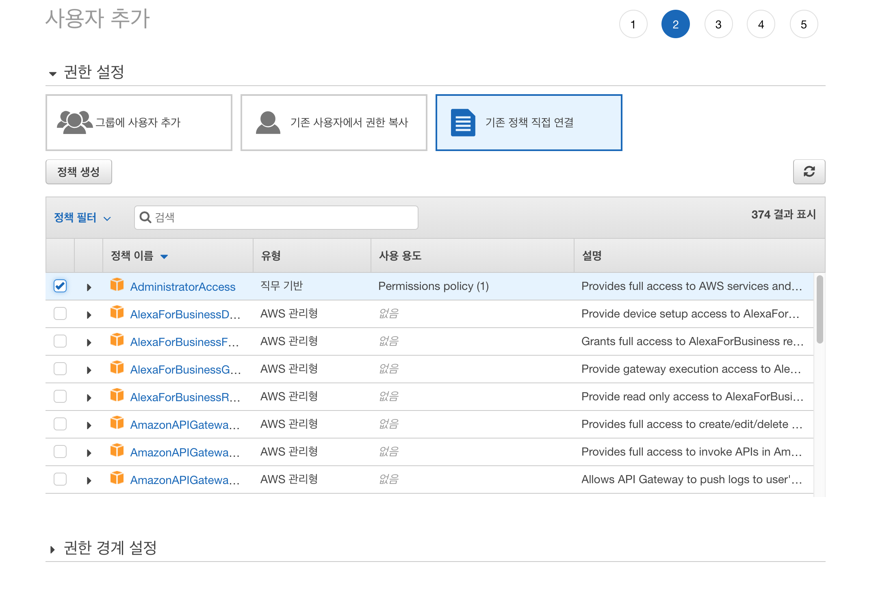


5. #### 나머지 설정은 생략 후 사용자 만들기를 선택해주세요.


6. #### 액세스 키 ID와 비밀 액세스 키 확인
> 비밀 액세스 키는 꼭 기억해주세요


- #### [ECR](https://aws.amazon.com/ko/ecr/)에 이미지 업로드 (스크린샷 올려야함)
> ECR은 이미지를 쉽게 저장, 관리 및 배포를 할 수 있는 Docker Container Registry 서비스입니다.
> ECR은 ECS와 통합되어 Production Flow를 단순화 할 수 있습니다.

1. #### AWS 콘솔에서 컴퓨팅 - ECS로 이동합니다.

2. #### 새 레포지토리를 생성하고, 안내되는 커맨드를 실행합니다.
> 레포지토리 URL을 기억해주세요
> 레포지토리 이름은 일관성을 위해 호스트 환경와 동일한 컨테이너 이름을 사용하는 것을 추천합니다.

> 커맨드 입력 전 `$ docker login`을 입력해주세요.

> Push 이후 no basic auth credentials가 반환 될 경우  
 `eval $(aws ecr get-login --no-include-email | sed 's|http://<레포지토리_URL>/<Image_name>||')`를 입력해주세요.

- #### 작업 정의(Task Definition) 생성
> Task function은 Docker CLI의 docker run 명령어와 같지만 여러 컨테이너에 작동합니다.

1. #### 새 작업 정의를 생성을 선택해주세요.

2. #### EC2를 선택해주세요.

3. #### 작업 정의 이름을 입력해주세요.

4. #### 컨테이너 추가를 선택해주세요.

5. #### 컨테이너 이름을 입력해주세요.
> 컨테이너 이름은 Push한 애플리케이션명을 사용해주세요.

6. #### 이미지 URL을 등록해주세요.
> 레포지토리 URL을 입력해주시면 됩니다.

7. #### 메모미를 소프트 제한 : 512로 설정합니다.

8. #### 호스트의 3000번 Port를 컨테이너의 3000번 Port와 매핑합니다.

9. #### 컨테이너 추가 후 작업 정의를 생성합니다.

- #### 클러스트 생성
> 클러스트는 AWS 컨테이너가 실행되는 장소이며, EC2 Instance와 유사한 구성을 사용합니다.

1. #### 클러스트 생성을 클릭하고, EC2 Linux + 네트워킹을 선택합니다.

2. #### 클러스트 이름과 EC2 Instance 유형을 지정하고 클러스터를 생성합니다. (프리티어 사이즈 확인)
> 해당 실습에서는 EC2 Instance에 SSH를 포함하지 않습니다.

- #### 서비스 생성

1. #### 작업 정의로 이동하여 생성한 작업 정의를 선택합니다.

2. #### 생성한 작업 정의를 체크 후 작업 드롭박스를 클릭하고 서비스 생성을 선택합니다.

3. #### 시작 유형은 EC2를 선택합니다.

4. #### 서비스 이름을 입력하고 작업 개수는 1로 설정합니다.

5. #### 나머지는 기본 설정을 따르고 서비스를 생성합니다.
> 해당 실습에서는 로드밸런서와 오토스케일링 옵션을 사용하지 않습니다.

6. #### 클러스터로 이동하여 생성한 클러스터를 선택합니다.

7. #### EC2 인스턴스 - 컨테이너 인스턴스를 클릭합니다.

8. #### Public DNS를 확인하고 접속합니다.

9. #### `Hello, world!`

---


